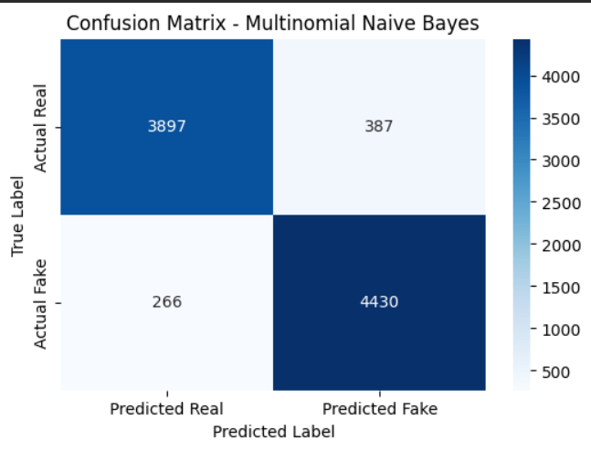
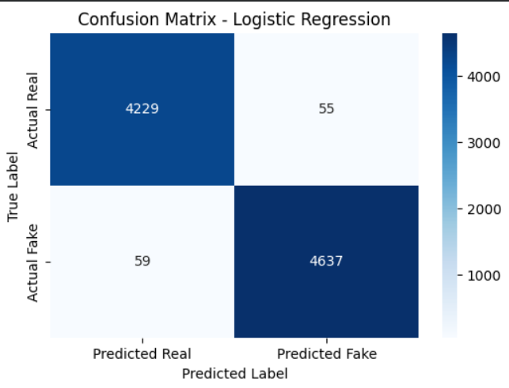
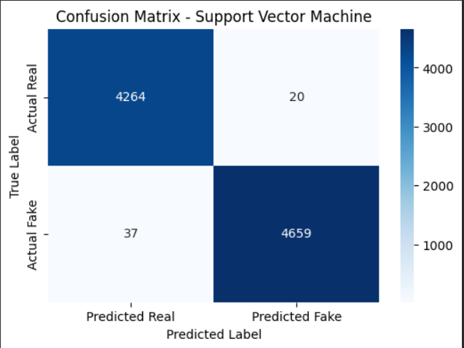

# Fake News Detection using NLP & Machine Learning

## 📌 Project Overview
This project implements a Fake News Detection system using Natural Language Processing (NLP) techniques to classify news articles as real or fake.

## 🧠 Model Approach
- Text Preprocessing (Tokenization, Stopword Removal)
- TF-IDF Feature Extraction
- Multinomial Naive Bayes
- Logistic Regression
- Support Vector Machine (SVM)

## ⚙️ Techniques Used
- Text Cleaning & Normalization
- Feature Engineering using TF-IDF
- Train-Test Split
- Model Evaluation using Accuracy, Precision, Recall, and F1-score
- Confusion Matrix Analysis

---

## 📊 Model Comparison

Three machine learning models were trained and evaluated to compare classification performance.

---

## 📈 Confusion Matrix – Naive Bayes


---

## 📈 Confusion Matrix – Logistic Regression


---

## 📈 Confusion Matrix – Support Vector Machine (SVM)


---

## 🏆 Best Performing Model
Support Vector Machine (SVM) achieved the highest classification performance with the lowest number of false positives and false negatives among the compared models.

---

## 🛠️ Technologies
Python, Scikit-learn, NLTK, Pandas, NumPy, Matplotlib

---

## 🚀 How to Run

### 1️⃣ Clone the repository
```bash
git clone https://github.com/anil-yadav1103/fake-news-detection-nlp
cd fake-news-detection-nlp
```

### 2️⃣ Install required libraries
```bash
pip install pandas numpy scikit-learn nltk matplotlib
```

### 3️⃣ Run the notebook
Open `fake_news_detection_naive_bayes.ipynb` in Jupyter Notebook or Google Colab and execute all cells.
